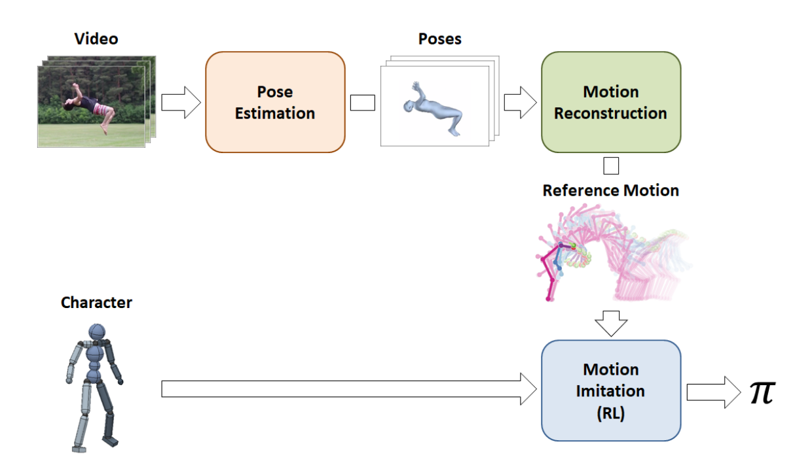

# Motion Reconstruction Code and Data for Skills from Videos (SFV)

This repo contains my adapted code for motion reconstruction component of the SFV :

## Data

The data for the project is composed of the handtools dataset file and a couple of videos of myself :

https://drive.google.com/file/d/145UBFXHlar7yP52eRXRplnO4OD6k14ph/view?usp=sharing

## Requirements
- [TensorFlow](https://www.tensorflow.org/) 
- [SMPL](http://smpl.is.tue.mpg.de/)
- Have the same `models/` structure as in [HMR](https://github.com/akanazawa/hmr/) (you need the trained models and `neutral_smpl_with_cocoplus_reg.pkl`)

## Steps to run:
0. install the requirements packages.
1. `python -m run_openpose.py`
2. `python -m refine_video.py`
3. `python -m ref_2.py`

You could also directly execute the notebook in the previous folder which include all the steps

## Sample outputs
- The image below show the output of the global pipeline on an input image. It includes the output of openpose along with the 3d mesh reconstruction for differents point of view.

- The video below show the the 3d mesh reconstruction for an input video

### Citation
If you use this code for your research, please consider citing:

SFV: Reinforcement Learning of Physical Skills from Videos  
Transactions on Graphics (Proc. ACM SIGGRAPH Asia 2018)  
Xue Bin Peng, Angjoo Kanazawa, Jitendra Malik, Pieter Abbeel, Sergey Levine  
University of California, Berkeley
[Project Page](https://xbpeng.github.io/projects/SFV/index.html)

